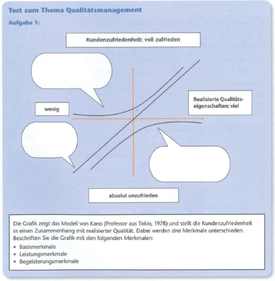
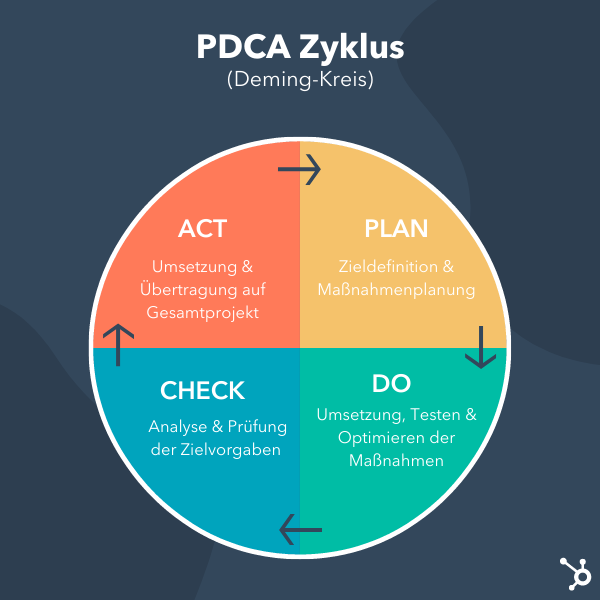

[zurück](../README.md)

# Qualitätsmanagement

1. [Überblick](#überblick)
2. [DIN EN ISO 9000 ff](#2-din-en-iso-9000-ff)
3. [Kundenzufriedenheit](#3-kundenzufriedenheit)
4. [PDCA Zyklus](#4-pdca-zyklus)
5. [Qualitätsplanung und -politik](#5-qualitätsplanung-und---politik)

## Überblick

- Produkte und Dienstleistungen haben __Qualität__
- Qualität beschreibt die Güte eines Produkts oder einer Dienstleistung
- zur Qualitätssicherung wird Qualitätsmanagementsystem etabliert
- wird durch __DIN EN ISO 9000__ geregelt

### Die Norm definiert 7 __Managementgrundsätze__

 Abkürzung | Eingabe | Lösung
-|-|-
K | <input type="text"> | 

Kundenorientiert

V d F | <input type="text"> | 

Verntwortlichkeit der Führung

E d b P | <input type="text"> | 

Einbeziehung der beteiligten Personen

P A | <input type="text"> | 

Prozessorientierter Ansatz

K V | <input type="text"> | 

kontinuierliche Verbesserung

S E | <input type="text"> | 

Sachbezogener Entscheidungsfindungsansatz

L z g N | <input type="text"> | 

Lieferantenbeziehungen zum gegenseitigen Nutzen

 

EFQM-Modell

- European Foundation of Quality Management-Modell

Kern dieses Modells: einbeziehung aller Mitarbeiter in stätige Verbessung der Qualität.

[zum Anfang](#qualitätsmanagement)

---

## 2. DIN EN ISO 9000 ff

Die ISO 9000 beschreibt die Grundlagen und Begriffe des Qualitätsmanagementsystems und ist somit eine Einführung in das Thema. Die ISO 9001 definiert die Anforderungen an ein Qualitätsmanagementsystem, das dazu dient, Produkte oder Dienstleistungen zu liefern, die den Anforderungen und Erwartungen der Kunden entsprechen. Die ISO 9004 gibt einen Leitfaden zur Verbesserung der Leistung und zur Erhöhung der Kundenzufriedenheit, indem sie Organisationen dabei unterstützt, die Effektivität und Effizienz ihres Qualitätsmanagementsystems zu steigern.

Diese Normen sind international anerkannt und werden von Unternehmen auf der ganzen Welt angewendet, um sicherzustellen, dass ihre Produkte und Dienstleistungen den Anforderungen und Erwartungen der Kunden entsprechen und um kontinuierlich ihre Prozesse und Leistungen zu verbessern.

- __ISO 9000__:2015 Qualitätsmanagementsysteme - Grundlagen und Begriffe
- __ISO 9001__:2015 Qualitätsmanagementsysteme - Anforderungen
- __ISO 9004__:2018 Qualitätsmanagementsysteme - Leitfaden zur Verbesserung der Leistung

### wichtigeste Inhaltspunkte

Abkürzung | Eingabe - Inhaltspunkt| Lösung | Eingabe - Inhalt | Lösung
-|-|-|-|-
B u D | <input type="text"> | 

Begriffe und Definitionenn  
|<input type="text"> | 

Relevante Begriffe für QMS

N V | <input type="text"> | 

Normative Verweisungen 
|<input type="text"> |
 
 
Verweis auf andere Normen, Anwendung in Bezug auf QMS

F | <input type="text"> | 

Führung
|<input type="text"> | 

oberste Führungsebene  ist verantwortlich QMS zu implementieren und aufrechtzuerhalten

P| <input type="text"> | 

Planung
|<input type="text"> | 

Identifizierung von Prozessen für Lieferung von Produkten und Dienstleistungen

U| <input type="text"> | 

Unterstützung
|<input type="text"> | 

Anforderungen an  Ressourcen, Kompetenzen, Infrastruktur und Arbeitsumgebung

K d O| <input type="text"> | 

Kontext der Organisation
|<input type="text"> | 

Identifizierung von internen und externen Einflussfaktoren

B| <input type="text"> | 

Betrieb
|<input type="text"> | 

Durchführung der  Prozesse (Überwachung, Messung und Analyse der Prozessleistung)

B| <input type="text"> | 

Bewertung
|<input type="text"> | 

Bewertung der  Wirksamkeit, Kundenzufriedenheit, Prozessleistung

V| <input type="text"> | 

Verbesserung
|<input type="text"> | 

Identifizierung und Durchführung von Maßnahmen zur Korrektur und Vorbeugung von Abweichungen

A| <input type="text"> | 

Anwendungsbereich
|<input type="text"> | 

welche Anforderungen muss Organisation erfüllen um QMS effektiv einzuführen

[zum Anfang](#qualitätsmanagement)

---
## 3. Kundenzufriedenheit

Grafik Kundenzufriedenheit

[zum Anfang](#qualitätsmanagement)

---

## 4. PDCA  Zyklus

[zum Anfang](#qualitätsmanagement)

## 5. Qualitätsplanung und - politik

Qualitätsplanung | Qualitätspolitik
-|-
Bestandteil des Qualitätsmanagements | duch Geschäftsleitung festgelegt
Erfüllung der Qualitätsanforderungen von Produkten, Dienstleistungen oder Prozessen | Ausrichtung des Unternehmens in Qualität
Maßnahmen zur Sicherzustellung der Qualitätsziele | legt Verantwortlichkeiten und Aufgaben der Mitarbeiter fest
Definition von Messverfahren und die Festlegung von Qualitätsstandards | schafft gemeinsames Verständnis von Qualitätsanforderungen
Minimierung der Fehler- und Ausschussrate | Basis für die Entwicklung und Umsetzung von Qualitätszielen
Maximierung der Qualität der Produkte oder Dienstleistungen |

[zum Anfang](#qualitätsmanagement)

---

## 6. Total Quality Management

- 

<b>Kundenorientierung</b>
Fokus auf Kundenzufriedenheit

- 

<b>Kontinuierliche Verbesserung</b>
 Verbesserung der Qualität ist kontinuierlichen Prozess

- 

<b>Prozessorientierung</b>
kontinuierliche Verbesserung von Prozessen

- 

<b>Mitarbeiterbeteiligung</b>
 fordert aktive Beteiligung der Mitarbeiter am Qualitätsverbesserungsprozess.

- 

<b>Führung</b>
starke Führung für die Umsetzung von Qualitätsinitiativen und -strategien

[zum Anfang](#qualitätsmanagement)

---

## 7. Softwarequalität

Test | Funktion
-|-
Modultest | Test einer einzelne Funktion oder Modul
Integrationstest | Test der Funktionen im zusammenspiel
Systemtest | Test der kompletten Software durch Nachbau der produktionsumgebung
Abnahmetest | wird durch Auftraggeber durchgeführt, Prüfung der geforderten Funktionalität

