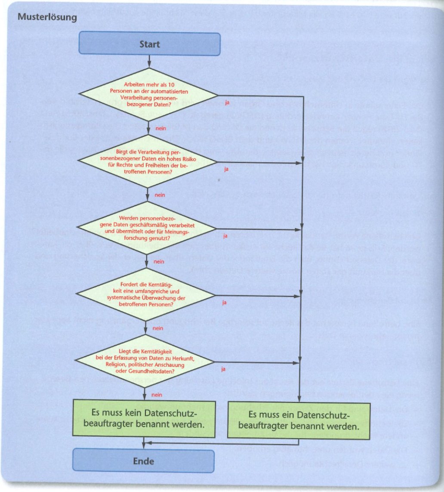

[zurück](../README.md)

# Datenschutz

## Inhaltsangabe

1. [DSGVO](#1-dsgvo---datenschutz-grundverordnung)
2. [BDSG](#2-bdsg---bundesdatenschutzgesetz)
3. [Datenschutzbeauftragter](#3-datenschutzbeauftrager)
4. [Standard Datenschutzmodell](#4-standard-datenschutzmodell)

---

## 1. DSGVO - Datenschutz-Grundverordnung

- Schutz personenbezogener Daten durch Europäische Union

Abkürzung | Eingabe | Lösung
-|-|-
Z z V p D | <input type="text"></input> | 

Zustimmung zur Verarbeitung personenbezogener Daten

R a A| <input type="text"></input> | 

Recht auf Auskunft

R a B| <input type="text"></input> | 

Recht auf Berichtigung

R a L| <input type="text"></input> | 

Recht auf Löschung

D F | <input type="text"></input> | 

Datenschutz-Folgenabschätzung

M v D | <input type="text"></input> | 

Meldung von Datenpannen

D B | <input type="text"></input> | 

Datebschutzbeauftragter

[zum Anfang](#datenschutz)

---

## 2. BDSG - Bundesdatenschutzgesetz

- regelt den Schutz personenbezogener Daten in Deutschland

Abkürzung | Eingabe | Lösung
-|-|-
Z d D | <input type="text"></input> | 

Zulässigkeit der Datenverarbeitung

R d b P| <input type="text"></input> | 

Rechte der betroffenen Person

A | <input type="text"></input> | 

Auftragsverarbeitung

D B | <input type="text"></input> | 

Datenschutzbeauftragte

S | <input type="text"></input> | 

Sanktionen

[zum Anfang](#datenschutz)

---

## 3. Datenschutzbeauftrager

Entscheidungshilfe

### Aufgaben

todo

[zum Anfang](#datenschutz)

---

## 4. Standard Datenschutzmodell

Abkürzung | Begriff | Lösung | Definition | Lösung
-|-|-|-|-
V | <input type="text"></input> | 

Vertraulichkleit
| <input type="text"></input> | 

Vertraulichkeit bezieht sich auf die Eigenschaft, dass bestimmte Informationen nur von autorisierten Personen oder Systemen zugänglich gemacht werden können. Es geht darum, sicherzustellen, dass sensible Daten nicht in falsche Hände geraten.

V | <input type="text"></input> | 

Verfügbarkeit
| <input type="text"></input> | 

Verfügbarkeit bezieht sich auf die Eigenschaft, dass Daten oder Systeme jederzeit und ohne Einschränkungen zugänglich sind. Ein hoher Grad an Verfügbarkeit ist besonders wichtig, um Geschäftsprozesse oder kritische Infrastrukturen am Laufen zu halten.

I | <input type="text"></input> | 

Integrität
| <input type="text"></input> | 

 Integrität bezieht sich auf die Eigenschaft, dass Daten oder Systeme vollständig, korrekt und unverändert sind. Es geht darum sicherzustellen, dass Daten nicht unbefugt geändert oder manipuliert werden.

D | <input type="text"></input> | 

Datenminimierung
| <input type="text"></input> | 

Datenminimierung bezieht sich darauf, dass nur diejenigen personenbezogenen Daten erhoben werden, die für den Zweck, für den sie verarbeitet werden sollen, auch wirklich erforderlich sind. Dies dient dem Schutz der Privatsphäre und minimiert das Risiko eines Datenmissbrauchs.

N | <input type="text"></input> | 

Nichtverkettung
| <input type="text"></input> | 

 Nichtverkettung bedeutet, dass personenbezogene Daten nicht ohne Notwendigkeit miteinander verknüpft werden. Hierdurch wird die Privatsphäre geschützt und das Risiko eines Missbrauchs reduziert.

T | <input type="text"></input> | 

Tranparenz
| <input type="text"></input> | 

Transparenz bedeutet, dass alle Betroffenen darüber informiert werden, welche personenbezogenen Daten erhoben, gespeichert, verarbeitet oder weitergegeben werden. Es geht darum, die Rechte der Betroffenen zu stärken und das Vertrauen in die Datenverarbeitung zu fördern.

I | <input type="text"></input> | 

Intervenierbarkeit
| <input type="text"></input> | 

 Intervenierbarkeit bezieht sich darauf, dass die Betroffenen die Möglichkeit haben, auf ihre personenbezogenen Daten zuzugreifen und gegebenenfalls eine Korrektur oder Löschung zu verlangen. Dies stärkt die Rechte der Betroffenen und fördert das Vertrauen in die Datenverarbeitung.

[zum Anfang](#datenschutz)

---
