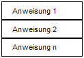
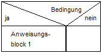
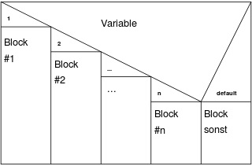
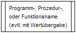
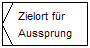
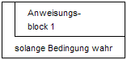
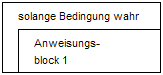
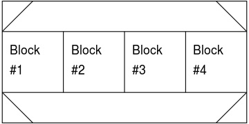
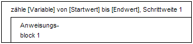

[zurück](../README.md)

# Software

## Inhaltsangabe

1. [Programmiersprachen](#1-programmiersprachen)
2. [XML](todo)
3. [HTML](todo)
4. [UML-Klassendiagramm](#4-uml-klassendiagramm)
5. [PAP-Programmablaufplan](#5-pap---programmablaufplan)
6. [Nassi - Shneidermann - Diagramm / Struktogramm](#6-nassi---shneidermann---diagramm--struktogramm)
    1. [SQL](#sql)

---

## 1. Programmiersprachen

Generationen | Beschreibung | Beispiel
-|-|-
1.| in den 1950er Jahren entwickelt und basierte auf Maschinensprache | Binärcode
2.| in den 1960er Jahren entwickelt und basierte auf Assembly-Sprache |  Assembler-Sprache.
3.|  in den 1970er Jahren entwickelt und zeichnete sich durch höhere Abstraktion, Komplexität und Funktionalität aus | C
4.|  in den 1980er Jahren entwickelt und zeichnete sich durch eine noch höhere Abstraktion und Automatisierung aus, die die Entwicklung von Datenbank- und Business-Systemen erleichterte | SQL
5.|  in den 1990er Jahren entwickelt und basierte auf der Idee der "wissensbasierten Systeme", die auf künstlicher Intelligenz und Expertensystemen aufbauen | Prolog
6.| Die sechste Generation von Programmiersprachen steht noch am Anfang der Entwicklung und bezieht sich auf die aktuelle Entwicklung von Sprachen, die auf Quantencomputern und der Künstlichen Intelligenz basieren | Q#.


[zum Anfang](./Software.md)

---

## 4. UML-Klassendiagramm

Unified Modeling Language  
<details>
<summary>
Aufbau:

</summary>

```
_________________
|     Name      |
|_______________|   
|               |
|   Attribute   |
|               |
|_______________| 
| Methoden/     |
|       Abläufe |
|_______________| 

```
</details>  
<br>


__Zugriffsmodifikatoren__  
Sämtliche Klassen verfügen, je nach Zugriffsmodifikator (Sichtbarkeit), über unterschiedliche Zugriffsebenen. Hier sehen Sie die unterschiedlichen Zugriffsebenen mitsamt ihren jeweiligen Symbolen:

Zugriffsmodifkator | Symbol
-|-
Öffentlich | (+)
Privat | (-)
Geschützt | (#)
Paket | (~)
Abgeleitet | (/)
Statisch | (unterstrichen)
Wirkungsbereiche für Mitglieder


Grundlegender Aufbau|||
-|-|-
Klassen | | eine Klasse represnätiert ein Objekt bzw. eine Klasse von Objekten <br>gemeinsame Struktur und gemeinsames Verhalten, Klassen werden durch ein Rechteck dargestellt
|| Name | Erste Zeile in einer Klassen-Notation
|| Attribute | Zweite Zeile in einer Klassen-Notation<br>Attributewerden in separaten Zeile dargestellt
|| Methoden | Dritte Zeile in einer Klassen-Notation <br> Auch als Vorgänge bekannt<br>in Listenformat dargestellt
Signale || Symbole, die eine einseitige, asynchrone Kommunikation zwischen aktiven Objekten darstellen.
Datentypen || Klassifizierer, die Datenwerte bestimmen. Datentypen können sowohl primitive Datentypen als auch Aufzählungen modellieren.
Pakete || Formen zum Ordnen verwandter Klassifizierer in einem Diagramm. Sie werden durch eine große, durch Tabs unterteilte, rechteckige Form dargestellt.
Schnittstellen || Eine Sammlung von Vorgangssignaturen und/oder Eigenschaftsdefinitionen, die eine geschlossene Menge von Verhaltensweisen definieren. Schnittstellen sind ähnlich wie Klassen, jedoch kann eine Klasse eine Instanz ihrer Art enthalten, während eine Schnittstelle mindestens eine Klasse zum Implementieren benötigt.
Aufzählungen || Darstellungen von benutzerdefinierten Datentypen. Eine Aufzählung enthält Gruppen von Identifikatoren, die Werte der Aufzählung repräsentieren.
Objekte || Instanzen einer oder mehrerer Klassen. Objekte können zu einem Klassendiagramm hinzugefügt werden, um konkrete oder prototypische Instanzen darzustellen.
Artefakte || Modellelemente, die für konkrete Entitäten in einem Software-System stehen, so zum Beispiel Dokumente, Datenbanken, ausführbare Dateien, Software-Komponenten und so weiter.

Interaktionen ||||
-|-|-|-
Vererbung |  Unterklasse übernimmt Eigenschaften einer Oberklasse<br> Dargestellt durch eine gerade Verbindungslinie mit geschlossener Pfeilspitze, die auf die Oberklasse zeigt | 
Bidirektionale Assoziation | standardmäßige Beziehung zwischen  Klassen <br> Klassen haben Kenntnis von der jeweils anderen und ihrer Beziehung zueinander<br> Assoziation wird mit einer geraden Linie zwischen zwei Klassen dargestellt<br> 0..1 oder 0..* oder 1 oder 1 ..* das Verhältnis an | 


<details>
<summary>
Beispiel:

</summary>

.png)
</details>


[zum Anfang](./Software.md)

---

## 5. PAP -  Programmablaufplan

Anweisung | Symbol
-|-
Start/Stop |<details><summary></summary> .png)</details>
Verbindung zum nächsten Element |<details><summary></summary> .svg.png)</details>
Anweisung/Operation |<details><summary></summary> .png)</details>
Unterprogramm |<details><summary></summary> .png)</details>
Verzweigung |<details><summary></summary> .png)</details>
Ein-/Ausgabe |<details><summary></summary> .png)</details>


[zum Anfang](./Software.md)

---

## 6. Nassi - Shneidermann - Diagramm / Struktogramm

Anweisung | Symbol
-|-
Anweisung |<details><summary></summary> </details>
Bedingung |<details><summary></summary> </details>
Case |<details><summary></summary> </details>
Aufruf |<details><summary></summary> </details>
Aussprung |<details><summary></summary> </details>
Fußgesteuerte Schleife |<details><summary></summary> </details>
Kopfgesteuerte Schleife |<details><summary></summary> </details>
Parallel Aufruf |<details><summary></summary> </details>
Zählschleife |<details><summary></summary> </details>

[zum Anfang](./Software.md)

---

## 7. Datenbanken

||Relationale Datenbank | objektorientierte Datenbank
-|-|-
Definition| - Daten werden in Tabellen organisiert<br> - Beziehungen zwischen Tabellen durch Schlüssel definiert <br> - Standard: SQL-Schnittstelle (Structured Query Language) | - basiert auf Konzepten der objektorientierten Programmierung<br> - Objekte werden in Klassen organisiert und können Eigenschaften, Methoden und Beziehungen zu anderen Objekten haben  <br> - Speicherung von Objekten in ihrer natürlichen Form <br> Aufrechterhaltuing komplexer Beziehungen zwischen Objekten <br> - Abfrage- und Manipulationssprachen von objektorientierten Datenbanken sind objektorientiert und können objektbezogene Konzepte wie Vererbung, Polymorphismus und Kapselung nutzen
Vorteile | - Tabellen leicht versändlich <br> - standardisierten SQL-Schnittstelle <br> - Gute Skalierbarkeit durch den Einsatz von Indexen und anderen Techniken zur Optimierung von Abfragen <br> - Breite Unterstützung durch Tools, Anwendungen und Cloud-Dienstleister | - Objektorientierte Datenbanken können komplexe Datenstrukturen besser abbilden als relationale Datenbanken <br> - Einfache Handhabung von komplexen Beziehungen zwischen Objekten und Klassen <br> - Einfache Erstellung von Vererbungshierarchien und Polymorphismus, die zur Wiederverwendung von Code und zur Verbesserung der Skalierbarkeit beitragen können <br> - Einfache Integration mit objektorientierten Programmiersprachen wie Java, C# und Python <br> - Einfache Handhabung von Multimedia-Objekten wie Audio, Video und Bilder 
Nachteile| - Schwierigkeiten bei Speicherung komplexer Datenstrukturen (JSON, XML) <br> - Struktur der  Datenbank muss im Voraus entworfen werden <br> - Notwendigkeit, Daten in mehrere Tabellen aufzuteilen, kann bei komplexen Datenmodellen zu hohem Aufwand führen <br> - Bei extrem großen Datenmengen kann es zu Leistungsproblemen kommen | - Eingeschränkte Unterstützung durch Datenbanksysteme, Tools und Cloud-Dienstleister <br> - Schwierigkeiten bei der Interoperabilität mit relationalen Datenbanken und anderen Anwendungen <br> - Eingeschränkte Skalierbarkeit bei großen Datenmengen <br> - Möglicherweise höhere Komplexität und Schwierigkeiten bei der Handhabung von Abfragen und Berichten <br> - Möglicherweise höhere Kosten für Implementierung und Wartung

### SQL

SQL Abfrage Kategorie | Beschreibung | Beispiele
-|-|-
Data Definition Language (DDL) | Datenbankobjekte wie Tabellen, Indizes, Sichten und Constraints erstellen, ändern und löschen | CREATE,<br> ALTER,<br> DROP
Data Manipulation Language (DML) | Daten in Tabellen bearbeiten| SELECT,<br> INSERT,<br> UPDATE,<br> DELETE
Data Control Language (DCL) | Zugriffsrechte auf Datenbankobjekte verwalten | GRANT, <br> REVOKE, <br>
Transaction Control Language (TCL) |Transaktionen in einer Datenbank verwalten | COMMIT,<br> ROLLBACK,<br> SAVEPOINT<br>

## 8. ER - Diagramm (Entity Relationship)