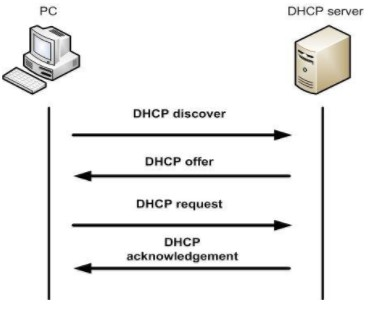
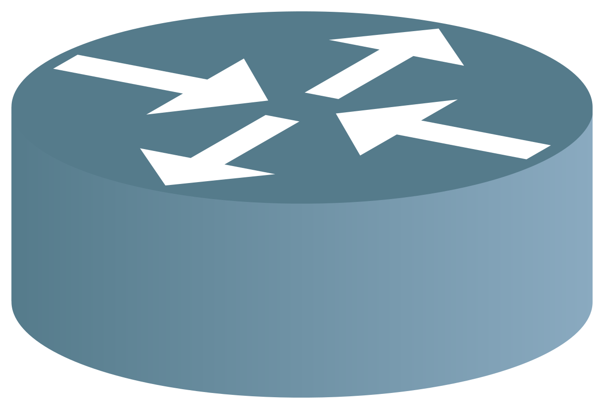

[zurück](../README.md)

# Abkürzungen

Abkürzung | voller Name | Beschreibung | Grafik
-|-|-|-
DNS | 
  
 
 Domain Name System
   | 
  
 
 IP Namensauflösung Name in IP,  reverse IP in Name 
 |
DHCP | 
  
 
   Dynamic Host Configuration Protocol
   | 
  
 
DHCP Server vergibt IP Adressen, sowie Informationen über Netzmaske, Gateway und Domainserver 
 | 
  
 
 

IEEE 802.11 bezeichnet die Normen des WLAN, der Marketingbegriff lautet Wi-Fi.  
SSID - Service Set Identifier - WLan Name

[zum Anfang](#abkürzungen)

---

## 1000 Base-T

  
Bezeichnung

  1000BASE-T ist Gigabit Ethernet über Kupferkabel.  
  

  

[zum Anfang](#abkürzungen)

---

## ARP

  
Bezeichnung

  address resolution protocoll
  

  
Nutzen

Netzwerkprotokoll das zu einer Netzwerkadresse der Internetschicht die physische Adresse (Hardware-Adresse) der Netzzugangsschicht ermittelt und diese Zuordnung gegebenenfalls in den ARP-Tabellen der beteiligten Rechner hinterlegt.

[zum Anfang](#abkürzungen)

---

## IP

  
Bezeichnung

Internet Protocol
  

  

  
Nutzen

Eine IP-Adresse ist eine Adresse in Computernetzen, die – wie das Internet – auf dem Internetprotokoll (IP) basieren. Sie wird Geräten zugewiesen, die an das Netz angebunden sind, macht die Geräte so adressierbar und damit erreichbar. Die IP-Adresse kann einen einzelnen Empfänger oder eine Gruppe von Empfängern bezeichnen (Multicast, Broadcast). Umgekehrt können einem Computer mehrere IP-Adressen zugeordnet sein.

[zum Anfang](#abkürzungen)

---

## MAC

  
Bezeichnung

Media-Access-Control
  

  

  
Nutzen

Die MAC-Adresse ist die Nummer eines Gerätes auf einer Datenverbindung. Anhand dieser Nummer werden über die Verbindung laufende Daten den Geräten zugeordnet. Die MAC-Adresse ist die Hardware-Adresse jedes einzelnen Netzadapters, die als eindeutiger Identifikator des Geräts in einem Rechnernetz dient.

[zum Anfang](#abkürzungen)

---

## PAN, LAN, WAN, MAN, WLAN, VLAN, GAN, VPN

### PAN

Bezeichnung

Personal Area Network

Nutzen

Um einen Datenaustausch zu ermöglichen, lassen sich moderne Endgeräte wie Smartphones, Tablets, Laptops oder Desktop-Computer ad hoc zu einem Netzwerk zusammenschließen. Dies kann kabelgebunden in Form eines Personal Area Networks (PAN) erfolgen. Übliche Übertragungstechniken sind USB oder FireWire. Die kabellose Variante Wireless Personal Area Network (WPAN) stützt sich auf Techniken wie Bluetooth,

### LAN

Bezeichnung

Local Area Network

Nutzen

Sollen mehrere Rechner zu einem Verbund zusammengeschlossen werden, erfolgt dies meist in Form eines Lokal Area Networks (LAN). Ein solches Ortsnetz kann zwei Rechner in einem privaten Haushalt umfassen oder mehrere tausend Geräte in einem Unternehmen. 

### MAN

  
Bezeichnung

  Metropolitan Area Networks 
  

  

  
Nutzen

Metropolitan Area Network (MAN) wird ein breitbandiges Telekommunikationsnetz genannt, das mehrere LANs in geografischer Nähe verbindet.

### WAN

  
Bezeichnung

  Wide Area Network
  

  

  
Nutzen

  Erstreckung über große geografische Bereiche wie Länder oder Kontinente.

### GAN

  
Bezeichnung

  Global Area Network
  

  

  
Nutzen

Ein weltumspannendes Netzwerk wie das Internet wird als Global Area Network (GAN) bezeichnet.

### WLAN

  
Bezeichnung

  

  

  
Nutzen

### VLAN

  
Bezeichnung

  

  

  
Nutzen

  

### VPN

  
Bezeichnung

   Virtual Privat Network 
  

  

  
Nutzen

   ist ein virtuelles Kommunikationsnetz, das die Infrastruktur eines physischen Netzwerks nutzt, um Computersysteme logisch zu verbinden. Dabei kann es sich um jeden der oben dargestellten Netzwerktypen handeln. Am gängigsten ist jedoch das Internet als Transportmedium. 

  

[zum Anfang](#abkürzungen)

## Swtich

---

  
Layer 2 Switch

    Die primäre Funktion eines Layer 2 Switches ist es, den Netzwerkverkehr von Geräten innerhalb eines LANs zu regeln. Ein Layer 2 Switch entscheidet mittels der MAC Adresse über welchen Pfad die Datenpakete zu übermitteln sind. Sie sind allerdings nicht für Routing gedacht.
  

  

  
Layer 3 Switch

    Erweiterung des Layer 2 Switches mit Routing Funktion (Router)
  

  

  
Layer 4 -7 Switch

Vermutlich nicht relevant  

Für Switches, die oberhalb der IP-Routing-Schicht 3 arbeiten, hat sich in der Praxis der Begriff "Layer-4-bis-7-Switching" oder "L4/L7-Switching" etabliert. Diese Definition zeigt, dass sich die im OSI-Schichtenmodell festgelegten oberen Schichten von 4 bis 7 in der Praxis nicht so eindeutig zuweisen lassen, wie dies die Theorie vorsieht.

Relativ klar abgegrenzt gibt sich immerhin noch der Layer 4. Hier arbeiten IP-basierende Dienste wie TCP, HTTP, UDP oder Telnet. Diese kommunizieren mit Anwendungen, die auf Layer 7 angesiedelt sind. Bei den OSI-Schichten 5 (Sitzung) und 6 (Darstellung) dagegen fällt die Zuordnung zu einzelnen Protokollen oder Anwendungen schwer. Daher fasst man die beiden Layer meist gemeinsam mit Layer 7 zur Gruppe der "anwendungsorientierten" Schichten zusammen. Layer 1 bis 4 bezeichnet man im Zug dieser vereinfachten Einteilung dagegen als "transportorientierte" Schichten.
  

---

## Router

  
Symbol

  

Funktion

Router sind Netzwerkgeräte, die Netzwerkpakete zwischen mehreren Rechnernetzen weiterleiten können.

[siehe auch Routing](todo)

---

## UDP

  
Bezeichnung

  User Datagram Protocol
  

  
Nutzen

  
Bei UDP handelt es sich um ein Kommunikationsprotokoll, das in erster Linie dazu dient, Verbindungen mit geringer Latenz und Verlusttoleranz zwischen Anwendungen im Internet herzustellen.

Es werden Daten gesendet ohne zu gewähleisten dass diese ankommen. 
Schnelle Verbindung und geringe Datenmenge nötig

  
Beispiel

  
- Internet Telefonie
- Streaming
- [DHCP](./Abkuerzungen.md/#dhcp)

  
Grafik

---

## TCP

  
Bezeichnung

  Transmission Control Protocol
  

  
Nutzen

Das Protokoll ist ein zuverlässiges, verbindungsorientiertes, paketvermitteltes Transportprotokoll in Computernetzwerken. Es ist Teil der Internetprotokollfamilie, der Grundlage des Internets.

Es werden Daten gesendet und gewähleistet dass diese ankommen. 
Langsame Verbindung und geringe Datenmenge nötig da langer Header und Rückantwort.

  
Beispiel

  
- Ping
- Internet Browsing 

  
Grafik

---

## Gateway

  
Funktion

  
Ein IT-System, das seinen Kommunikationspartner nicht direkt kennt, wendet sich an sein Gateway. Das Gateway stellt die Brücke zur Kommunikation zwischen mehreren internen oder auch externen Netzwerkabschnitten dar. Die Bezeichnung Gateway impliziert, dass die weitergeleiteten Daten zur Weiterleitung in ihrer Adressierung bearbeitet werden. Dabei kann es sich um Daten in allen Schichten des OSI-Modells handeln. Je nach Schicht, auf der die Bearbeitung stattfindet, existieren spezifischere Begriffe für entsprechende Systeme.  

---

## Proxy

  
Begriff

Ein Proxy (von englisch proxy representative „Stellvertreter“, von lateinisch Procuratorem „für etwas sorge tragen“) ist eine Kommunikationsschnittstelle in einem Netzwerk aus Rechnern in Form eines physischen Computers (z. B. Server oder seltener auch Personal Computer). Er arbeitet als Vermittler, der auf der einen Seite Anfragen entgegennimmt, um dann über seine eigene Adresse eine Verbindung zur anderen Seite herzustellen.

---

## EMV

  
Name

Elektro magnetische Verträglichkeit

  
Definition

Beschreibt die Störverträglichkeit bzw. Störfestigkeit und die Störung auf andere Geräte.

