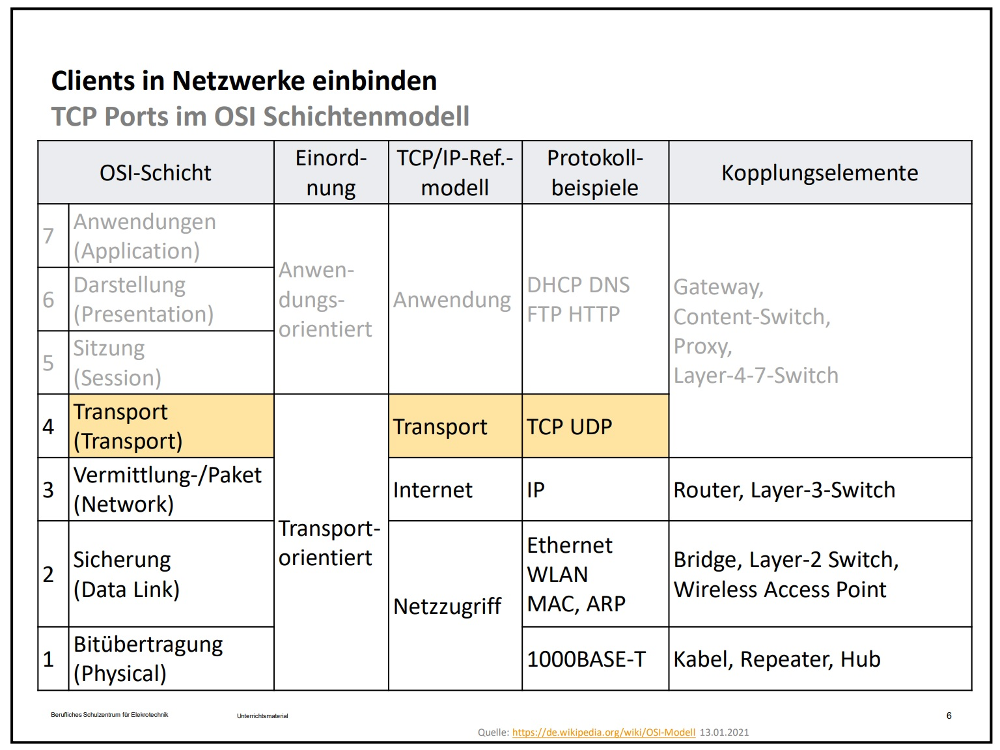

[zurück](../README.md)

# OSI - Schichtenmodel

- [Grafik](#grafik)
- [1. Schicht](#1-schicht)
- [2. Schicht](#2-schicht)
- [3. Schicht](#3-schicht)
- [4. Schicht](#4-schicht)
- [5. - 7. Schicht](#5---7-schicht)

# Grafik

  
OSI - Schichtenmodell - Grafik

  

  

[zum Anfang](#osi---schichtenmodel)

# 1. Schicht

  
Name

  Bitübertragung  
  eng: Physical 

 

  
Orientierung

Transport orientiert

  
Protokoll
  

[1000 Base-T](./Abkuerzungen.md/#1000-base-t)

  
Beispiel

- Kabel  
- Hub
- Repeater
  

[zum Anfang](#osi---schichtenmodel)

# 2. Schicht

  
Name

  Sicherung  
  eng: Data Link 

 

  
Orientierung

Transport orientiert

  
Protokoll
  

- Ethernet
- [ARP](./Abkuerzungen.md/#arp)
- [WLAN](./Abkuerzungen.md/#lan-wan-man-wlan-vlan-gan-vpn)
- [MAC](./Abkuerzungen.md/#mac)

  
Beispiel

- Bridge
- Layer 2 [Switch](./Abkuerzungen.md/#swtich)
- [WLAN](./Abkuerzungen.md/#lan-wan-man-wlan-vlan-gan-vpn) Access Point

  

[zum Anfang](#osi---schichtenmodel)

# 3. Schicht

  
Name

  Vermittlung  
  eng: Network

 

  
Orientierung
  
Transport orientiert

  
Protokoll
  

- [IP](./Abkuerzungen.md/#ip)

  
Beispiel

- Layer 3 [Switch](./Abkuerzungen.md/#swtich)
- Router [Router](./Abkuerzungen.md/#router)

  

[zum Anfang](#osi---schichtenmodel)

# 4. Schicht

  
Name

  Transport  
  eng: Transport  

 

  
Orientierung
  
Transport orientiert

  
Protokoll
  

- [TCP](todo)
- [UDP](todo)

  
Beispiel

- [Gateway](todo)
- [Proxy](todo)

  

[zum Anfang](#osi---schichtenmodel)

# 5. - 7. Schicht

  
5. Name

  Sitzung
  eng: Session

  
6. Name

  Darstellung
  eng: Presentation

  
7. Name

  Anwendung
  eng: Application

 

  
Orientierung
  
Anwendungs orientiert

  
Protokoll
  

- [DHCP](todo)
- [DNS](todo)
- [FTP](todo)
- [HTTP](todo)

  
Beispiel

- [Gateway](todo)
- [Proxy](todo)
- [Layer 4-7 Switch](./Abkuerzungen.md/#swtich)

  

[zum Anfang](#osi---schichtenmodel)
