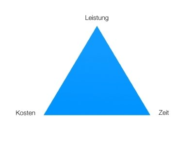

[zurück](../README.md)

# 1. Projektmanagement

1. [Grundlagen](#11-grundlagen)
2. [magisches Dreieck](#das-magische-dreieck)
3. [PRINCE 2](#3-prince-2)
4. [Gantt - Diagramm](#4-gantt---diagramm)
5. [Netzplan](#5-netzplan)
6. [Wasserfallmodell](#6-wasserfallmodell) Peter fragen
7. [Agile Modelle](#7-agile-modelle)
8. [SCRUM](#8-scrum)

## 1.1 Grundlagen
Lehrbuch Seite 17.
Kapitel 2.1

### Projektmanagementsystem

  
Definition

  Planen, Steuern und kontrollieren von Projekten durch Anwendung von Methoden, Hilfsmitteln, Techniken. (DIN ISO 21500)

- Projektmangement System wird etabliert
- Definition von Rollen und Verantwortlichen
- Festlegung und Dokumentation von Methoden
- __DIN 69901__ stellt Anforderungen Projektmangementsysteme

### Softwareentwicklung

Neue Art des Projektmanagements:

Agile
Manifest

### Mangementbereiche

Abkürzung | Management
-|-
Q | 

Qualitätsmangement

K | 

Kommunktionsmanagement

R | 

Risikomanagement

I | 

Integrationsmanagement

I u U | 

Inhalts- und Umfangsmanagement

T | 

Terminmanagement

K | 

Kostenmanagement

P | 

Personalmanagement

B | 

Beschaffungsmanagement

[zum Anfang](#1-projektmanagement)

## 2. Das magische Dreieck

Zusammenhang zwsichen wichtigen Kenngrößen des Projektmanagements:

Nenne die wichtigen Kenngrößen:

[zum Anfang](#1-projektmanagement)

## 3. PRINCE 2

Neben DIN/ISO --> international anerkannte Systeme wie

PRINCE 2
PRojects IN Controlled Environments

- Vorteil: bereits praktische erprobt

[zum Anfang](#1-projektmanagement)

## 4. Gantt - Diagramm

- Balkendiagramm
- Visualisierung von Projektzeitplan
- Abhängigkeiten zwischen Aufgaben

[zum Anfang](#1-projektmanagement)

## 5. Netzplan

Arbeitspaketsname |  | | |
-|-|-|-
| | FAZ | D | FEZ
| | SAZ | P | SEZ

__FAZ__: Frühester Anfangszeitpunkt
__D__: Dauer
__FEZ__: Frühster Endzeitpunkt
__SAZ__: Spätester Anfangszeitpunkt
__P__: Puffer
__SEZ__: spätester Endzeitpunkt

[zum Anfang](#1-projektmanagement)

## 6. Wasserfallmodell

todo
Peter fragen

[zum Anfang](#1-projektmanagement)

## 7. Agile Modelle

Agile Modelle im Projektmanagement sind Ansätze, die auf der agilen Manifesto und agilen Methoden basieren. Die agilen Modelle haben das Ziel, Projekte schneller, flexibler und kundenorientierter zu gestalten.

Die bekanntesten agilen Modelle im Projektmanagement sind:

__Scrum__: Ein Rahmenwerk für die Entwicklung von Produkten, das Iterationen und regelmäßige Feedback-Schleifen nutzt, um sicherzustellen, dass das Produkt den Anforderungen des Kunden entspricht.

__Kanban__: Ein Ansatz, der visuelle Signale und begrenzte WIP (Work-in-Progress) nutzt, um den Workflow zu steuern und zu optimieren.

__Lean Software Development__: Ein Ansatz, der auf den Prinzipien des Lean Manufacturing basiert und darauf abzielt, Verschwendung zu minimieren und die Wertschöpfung für den Kunden zu maximieren.

__Extreme Programming (XP)__: Ein agiles Framework, das auf der Überzeugung basiert, dass durch ständige Kommunikation, Feedback und Anpassungen ein hochwertiges Ergebnis erreicht werden kann.

__Crystal Methods__: Eine Familie von agilen Methoden, die auf den Bedürfnissen des Projekts und der Projektteilnehmer angepasst werden können.

[zum Anfang](#1-projektmanagement)

## 8. SCRUM

- eng: Gedränge
- zur agilen Softwareentwicklung, aber auch anderen Bereichen

### Beispiel

Abkürzung | Management
-|-
__Planung__ | 

Das Team besteht aus einem Produktbesitzer, drei Entwicklern und einem Scrum-Master. Das Team erstellt eine Liste von Anforderungen für die zu entwickelnde Software und erstellt ein Product Backlog

__Sprint__ | 

 Das Team wählt einen Zeitraum von zwei Wochen für den ersten Sprint aus. Es wählt die wichtigsten Anforderungen aus dem Product Backlog aus und beginnt mit der Entwicklung.

__Daily Scrum__ | 

 Jeden Tag treffen sich das Team und bespricht den Fortschritt des aktuellen Sprints. Die Entwickler teilen ihre Arbeitsfortschritte und Probleme mit, und das Team diskutiert Lösungen.

__Sprint Review__ | 

Am Ende des Sprints stellt das Team die entwickelten Funktionalitäten dem Produktbesitzer vor. Der Produktbesitzer gibt Feedback und bespricht eventuelle Änderungen im Product Backlog.

__Sprint Retrospective__ | 

Das Team diskutiert, was während des Sprints gut lief und was verbessert werden kann. Es identifiziert Maßnahmen, die in zukünftigen Sprints umgesetzt werden können, um die Prozesse und Praktiken zu verbessern.

__Wiederholung__ | 

Das Team wiederholt den Prozess mit einem neuen Sprint und führt kontinuierliche Verbesserungen durch.

__Scrum Schema__ | 

[zum Anfang](#1-projektmanagement)